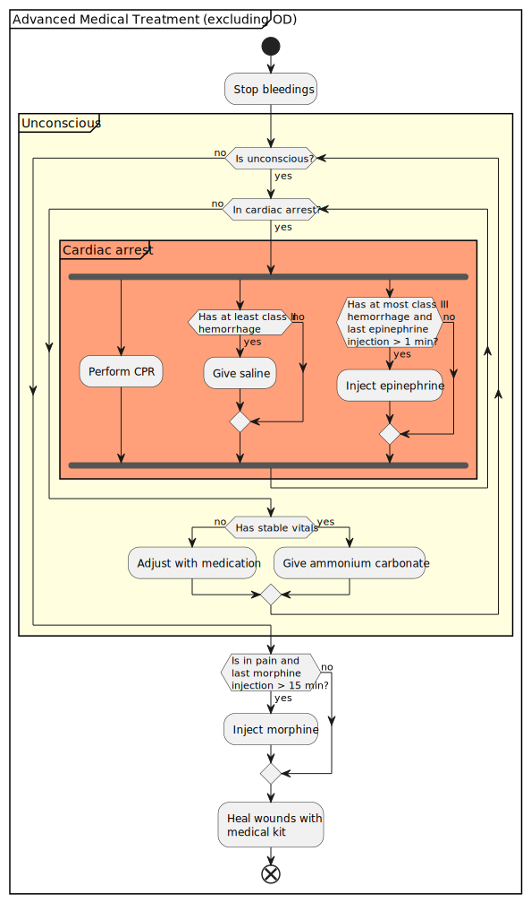

ACE Medical Prototypes builds on top of ACE Medical and serves as a testbed for more advanced features to be added to ACE Medical in future. Current prototypes:
- Cardiovascular system:
    - Simulation of heart rate and blood pressure
    - Cardiac arrest state and CPR for revival
- Medication system
    - Removes all "training wheels", _i.e._ drugs can always be administered and overdosed
    - Exchanges epinephrine with ammonium carbonate. Epinephrine has now a different role.
    - New types of drugs
    - Advanced simulation of drug effects and their evolution over time
- Damage system overhaul:
    - Death is no longer determined by a virtual health hit zone, but by the health of individual "vital" hit zones (_i.e_ torso and head). Second chance can be enabled for going to cardiac arrest instead of dying outright from deadly blows to vital hit zones. Second chance is enabled for torso and disabled for head by default.
    - New brain hit zone that takes continuously damage while in cardiac arrest and no CPR is performed. Runs out of health in approximately 5 minutes.

The changes are also applied to AI, but they will currently directly die when they enter cardiac arrest.

## Glossary
- BP: Blood pressure
- HR: Heart rate
- OD: Overdose
- $t_{max}$: Time until maximum effect
- $t_{½}$: Time until effect diminishes to 50% of maximum effect (relative to administration time, not $t_{max}$)
- $TD_{50}$: Number of doses at which 50% of patients fall unconscious
- $LD_{50}$: Number of doses at which 50% of patients experience cardiac arrest

## Medications

All currently available forms of medications are summarized in the table below:

| Name | Effects | $t_{max}$	| $t_{½}$ | $TD_{50}$ | $LD_{50}$ |
| --- | --- | --- | --- | --- | --- |
| Ammonium carbonate package | <ul><li>Wakes up stable unconscious patients</li></ul> | 2-3 s | 3-4 s | --- | --- |
| Epinephrine injector | <ul><li>Increases HR</li><li>Increases revive chance</li></ul> | 23 s | 1 min 3 s | --- | 4.4 |
| Metoprolol injector | <ul><li>Decreases HR</li></ul> | 25 s | 1 min 9 s | 2.1 | 2.8 |
| Morphine injector | <ul><li>Suppresses pain</li><li>Decreases HR</li><li>Decreases BP</li></ul> | 1 min 57 s | 15 min 20 s | 2.2 | 3.1 |
| Naloxone injector | <ul><li>Treats morphine OD</li></ul> | 1 min 35 s | 7 min 26 s | --- | --- |
| Phenylephrine injector | <ul><li>Slows down bleeding and transfusion</li><li>Increases BP</li></ul> | 29 s | 1 min 18 s | --- | 2.9 |

## Vital ranges

Blood volumes are categorized into six classes:
- Normal
- Class I hemorrhage (lost < 30%)
- Class II hemorrhage (lost 30%)
- Class III hemorrhage (lost 60%)
- Class IV hemorrhage (lost 80%)
- Fatal (lost 100%)

The values of the vitals (_e.g._ HR and BP) are essential for getting a patient back up. While in cardiac arrest, only CPR may get the patient back up, but the vitals are still essential for the success of reviving. An unconscious patient will automatically recover resilience once their vitals are stable, but to speed up the recovery, one can apply ammonium carbonate (_i.e._ like epinephrine in ACE Medical). Ammonium carbonate has no effect as long as the vitals aren't stable though.

| State | HR [BPM] | BP [mmHg] | Hemorrhage class |
| --- | --- | --- | --- |
| Cardiac arrest | > 220 | > 284/189 | --- |
| Unconscious | > 220 | > 284/189 | --- |
| Stable | 40 - 220 | 69/46 - 284/189 | < II*/III |
| Unconscious | < 40 | < 69/46 | II*/III |
| Cardiac arrest | < 20 | < 51/34 | IV |

\* Class II hemorrhage does not lead to unconsciousness, but prevents becoming conscious

## Guide for doing treatments



## Settings

Certain aspects of the medical system can be configured in the mission header section of a server config file. An overview of available fields is given below:

### `m_ACE_Medical_Settings`

| Field | Type | Default | Description |
| --- | --- | --- | --- |
| `m_bSecondChanceOnHeadEnabled` | `bool`* | `false` | Enables second chance on headshots |
| `m_bSecondChanceOnTorsoEnabled` | `bool`* | `true` | Enables second chance on torso |
| `m_bHealSupplyUsageEnabled` | `bool`* | `true` | Healing consumes supplies when enabled Ignored when global supply usage is disabled |
| `m_fMedicalKitMaxHealScaled` | `float` | `0.5` | Maximum scaled health (from 0.0 to 1.0) that a medical kit can heal outside of medical facilities |
| `m_CardiovascularSystem` | `object` | --- | Settings for cardiovascular system (see below) |
| `m_MedicationSystem` | `object` | --- | Settings for medication. Modify at your own risk |

\* Note that bool has to be provided as integer in the config: 1 (true) or 0 (false).

### `m_CardiovascularSystem`

| Field | Type | Default | Description |
| --- | --- | --- | --- |
| `m_fDefaultHeartRateBPM` | `float` | `80` | Default heart rate [BPM] |
| `m_fDefaultStrokeVolumeML` | `float` | `95` | Default stroke volume [ml] |
| `m_fDefaultMeanArterialPressureKPA` | `float` | `12.443` | Default mean arterial pressure [kPa] |
| `m_fDefaultPulsePressureKPA` | `float` | `5.3329` | Default pulse pressure [kPa] |
| `m_fCriticalHeartRateThresholdLowBPM` | `float` | `40` | A heart rate below this will results in critical state [BPM] |
| `m_fCriticalHeartRateThresholdHighBPM` | `float` | `220` | A heart rate above this will results in critical state [BPM] |
| `m_fCriticalMeanArterialPressureThresholdLowKPA` | `float` | `7.11` | An arterial pressure below this will result in critical state [kPa] |
| `m_fCriticalMeanArterialPressureThresholdHighKPA` | `float` | `29.5` | An arterial pressure above this will result in critical state [kPa]|
| `m_eCriticalBloodLevelThreshold` | `enum` | `CLASS_3_HEMORRHAGE` | A blood level below this will result in critical state |
| `m_CardiacArrestDamageEffect` | `object` | --- | Damage effects caused by cardiac arrest |
| `m_fCardiacArrestHeartRateThresholdLowBPM` | `float` | `20` | A heart rate below this will results in cardiac arrest [BPM] |
| `m_fCardiacArrestHeartRateThresholdHighBPM` | `float` | `220` | A heart rate above this will results in cardiac arrest [BPM] |
| `m_fCardiacArrestMeanArterialPressureThresholdLowKPA` | `float` | `5.21` | An arterial pressure below this will result in cardiac arrest when the heart rate is critical [kPa] |
| `m_fCardiacArrestMeanArterialPressureThresholdHighKPA` | `float` | `29.5` | n arterial pressure above this will result in cardiac arrest [kPa] |
| `m_eCardiacArrestBloodLevelThreshold` | `enum` | `CLASS_4_HEMORRHAGE` | A blood level below this will result in cardiac arrest |
| `m_bCardiacArrestForAIEnabled` | `bool`* | `false` | AI will die instead of entering cardiac arrest if false |
| `m_fCPRSuccessCheckTimeoutS` | `float` | `22` | Default delay between check for successful CPR [s] |
| `m_fCPRSuccessChanceMin` | `float` | `0` | Chance for exiting cardiac arrest while performing CPR at class IV hemorrhage |
| `m_fCPRSuccessChanceMax` | `float` | `0.4` | Chance for exiting cardiac arrest while performing CPR at above class II hemorrhage |
| `m_eMinBloodLevelForResilienceRecovery` | `enum` | `CLASS_2_HEMORRHAGE` | A blood level below this will prevent resilience from recovering |
| `m_fMaxRevivalResilienceRecoveryScale` | `float` | `0.2` | Maximum resilience recovery scale applied after getting revived. This scale gets multiplied by the scaled health of the brain and will be removed once the patient becomes conscious. |

Example for the `missionHeader` in a server config:
```
"missionHeader": {
    "m_ACE_Settings": {
        "m_ACE_Medical_Settings": {
            "m_bSecondChanceOnHeadEnabled": 1,
            "m_bSecondChanceOnTorsoEnabled": 1,
            "m_bHealSupplyUsageEnabled": 0,
            "m_fMedicalKitMaxHealScaled": 0.5,
            "m_CardiovascularSystem": {
                "m_fDefaultHeartRateBPM": 75
            }
        }
    }
}
```
